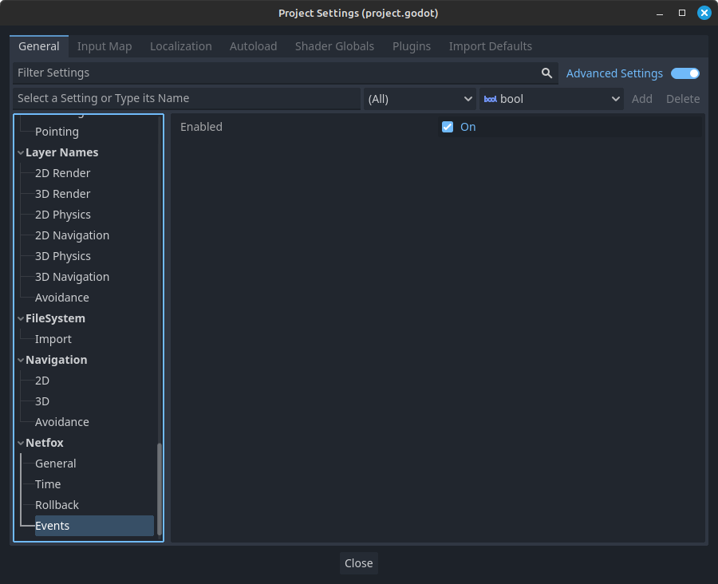

# NetworkEvents

Provides convenience signals for multiplayer games. Included as an autoload.

Keeps track of the root *multiplayer* instance and fires signals when it
changes. Using *NetworkEvents*' signals are safe even when the *multiplayer*
instance changes, as the signals are updated upon instance change.

Provides missing signals for server start and server stop events.

## NetworkTime

When enabled, *NetworkEvents* will start [NetworkTime] when it detects that a
server or a client is started. It will stop [NetworkTime], when it detects that
the currently running server or client is stopped.

## Settings

Settings are found in the Project Settings, under Netfox > Events:

*Enabled* toggles network events. When disabled, *NetworkEvents* will not emit
any events or track the multiplayer instance. This may slightly improve
performance, as it completely stops Godot from processing the *NetworkEvents*
node.

[NetworkTime]: ./network-time.md
