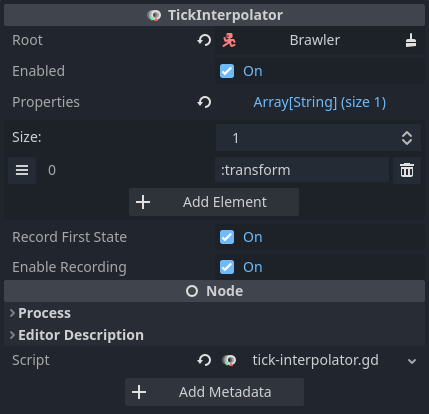

# Property paths

Multiple nodes have *properties* as their configurations. These are specified
as *property paths*, which have a specific syntax.



These nodes have a *Root* property. During path resolution, this
*Root* node is taken as base for relative paths.

## Syntax

Property paths are specified as follows:

```txt
<node-path>:<property-name>
```

Node path can be *empty* if it refers to a property on the *root* node.

If specified, node path will be interpreted relative to the *root* node. Any valid [NodePath] will work as expected.


With Brawler as root:

* `:position` refers to the Brawler's position
* `Input:aim` refers to the Input's aim

[NodePath]: https://docs.godotengine.org/en/stable/classes/class_nodepath.html
