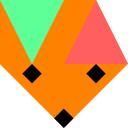

  

# netfox

A set of addons for responsive online games with the [Godot engine].

## Features

* ⏲️  Consistent timing across multiple machines
* 🖥️ Supports client-server architecture
* 🧈 Smooth motion with easy-to-use interpolation
* 💨 Lag compensation with Client-side Prediction and Server-side Reconciliation
* 🛜 Bullet-proof connectivity with [noray] integration

## Overview

The package consists of multiple addons, each with different features:

* [netfox]
    * The core package, implements timing, rollback and other multiplayer
      features
    * *Start here*
* [netfox.noray]
    * Implements [noray] integration to establish connection between players
    * *Useful for online games*
* [netfox.extras]
    * Provides high-level, game-specific, convenience features built on top of
      netfox, like base classes for input management or weapons
    * *Check for reusable components for your game*
* [netfox.internals]
    * Shared utilities for the other addons
    * Included as dependency, no need to install separately

## Install

### Releases

Find the latest netfox under
[Releases](https://github.com/foxssake/netfox/releases)

Each release contains the addons, and a build of [Forest Brawl] for Windows and
Linux. Each addon has its dependencies packed with it - e.g.
*"netfox.extras.vx.y.z.zip"* also contains both *netfox* and
*netfox.internals*.

> Note: For releases before v1.1.1, a separate *".with-deps.zip"* version
> contains the addon and its dependencies, while the regular zips contain only
> the addon itself.

### Asset Library

Search for the addon name in Godot's AssetLib or download from the site:

* [netfox](https://godotengine.org/asset-library/asset/2375)
* [netfox.noray](https://godotengine.org/asset-library/asset/2376)
* [netfox.extras](https://godotengine.org/asset-library/asset/2377)

### Source

Download the [source] and copy the addons of your choice to your Godot project.

### Enable the addons

After adding *netfox* to your project, make sure to enable the addons in your
project settings. Otherwise, Godot will present you with errors about
undeclared identifiers.

## Supported versions

Godot 4.x is supported by netfox. If you find any issue using any supported
version, please [open an issue].

Forest Brawl and the other examples are written against Godot 4.1. They may or
may not work when opened with any other version.

## Prototyping

To try your game online with [noray], a free to use instance is hosted at
`tomfol.io:8890`, the same instance used by [Forest Brawl].

You can use this [noray] instance to quickly test your games online, but is not
recommended for shipping games. The instance has configured limits, and no
uptime guarantees are made.

## About this documentation

These pages assume that you are familiar with both Godot, its multiplayer
capabilities, and building multiplayer games in general. Missing any of these
might make your reading experience more difficult than preferred.

Some links to get you up to speed:

* [Godot Engine docs](https://docs.godotengine.org/en/stable/index.html)
* [Godot Engine High-level multiplayer](https://docs.godotengine.org/en/stable/tutorials/networking/high_level_multiplayer.html)
* [Networking for Physics Programmers](https://www.gdcvault.com/play/1022195/Physics-for-Game-Programmers-Networking)

## About the tutorials

The tutorials are intended to get you started fast, but don't explain much of
how things work. For that, refer to the guides.

[netfox]: https://github.com/foxssake/netfox/tree/main/addons/netfox
[netfox.noray]: https://github.com/foxssake/netfox/tree/main/addons/netfox.noray
[netfox.extras]: https://github.com/foxssake/netfox/tree/main/addons/netfox.extras
[netfox.internals]: https://github.com/foxssake/netfox/tree/main/addons/netfox.internals
[Forest Brawl]: https://github.com/foxssake/netfox/tree/main/examples/forest-brawl

[open an issue]: https://github.com/foxssake/netfox/issues

[Godot engine]: https://godotengine.org/
[noray]: https://github.com/foxssake/noray
[source]: https://github.com/foxssake/netfox/archive/refs/heads/main.zip
