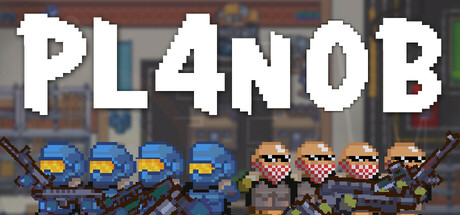
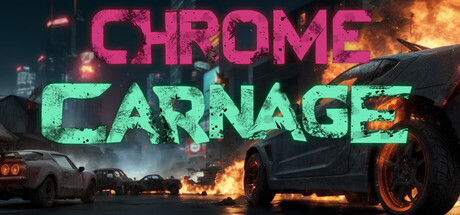

# Made with netfox

## Bubble Battle

Bubble Battle is a retro online/local multiplayer fighting game inspired by
arcade classics. Players fly around with one simple objective: burst opponents’
bubbles before they burst yours. Collect powerups and out-maneuver opponents
for fast-paced, addictive fun!

[:simple-steam: Steam](https://store.steampowered.com/app/3180520/Bubble_Battle/)

## PL4no-B

The best and most modern 2D tactical shooter, inspired by Counter-Strike and
Hotline Miami. Play online with friends or meet new ones in diverse game modes.
Unlock a huge variety of guns and utilities, earn points to build your base,
unlock features, and invade other players’ bases for endless fun! 

[:simple-steam: Steam](https://store.steampowered.com/app/3423700/PL4noB/)

## Chrome Carnage

Machines took all jobs but one - urban blood sport. Chrome Carnage is a
multiplayer top down shooter set in vibrant chaotic cyberpunk cities. 

*Chrome Carnage* is a top-down shooter drenched in the glow of cyberpunk
dystopia, where hope is scarcer than a working vending machine. Rising sea
levels have forced humanity into overcrowded platform cities.

With everyone on basic welfare a mysterious underground app has the desperate
masses hooked: win brutal street tournaments, score hectic amounts of crypto,
and maybe—just maybe—eat something that doesn’t squeak.

[:simple-steam: Steam](https://store.steampowered.com/app/3204000/Chrome_Carnage/)

## Your game here!

Building something cool with *netfox*? Whether it's a game, an app, tool, or
anything else, we'd be happy to showcase it!

Reach out on [Github discussions], on [Discord], or in the comments at the
bottom of this page.

[Github discussions]: https://github.com/foxssake/netfox/discussions/207
[Discord]: https://discord.gg/xWGh4GskG5

