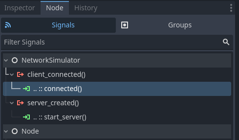

# NetworkSimulator

During testing, it is crucial to test your game under realistic network
conditions, including latency and potentially packet loss.

Network conditions can be simulated using [clumsy], [netem], or with *netfox*'s
*NetworkSimulator*. It auto-connects instances when launched from the editor,
and simulates various network configurations.

## How to Use

Enable and configure *Autoconnect* in the project settings.

When your game launches one instance will start an [ENetMultiplayerPeer] server
and the rest will connect to it.

Either a `NetworkSimulator.server_created` or
`NetworkSimulator.client_connected` signal will be fired which you can use to
bootstrap your game code to.

!!!note
    *NetworkSimulator* will only work when the game is ran from the editor.
    Otherwise it will disable itself, regardless of project settings. This is a
    failsafe to avoid affecting production builds of your games.

## Configuration

Hostname
: The hosting address. Usually `127.0.0.1` but can be changed to `*`, if you
want other machines to be able to join.

Server Port
: Which port to listen on. A second server port with latency / loss will open
one number higher if they are set to more than zero.

Use Compression
: Will make use of ENET's range encoder to keep packet sizes down.

Simulated Latency ( ms )
: Traffic delay, in milliseconds.

Simlated Packet Loss Chance
: What percentage of packets will to drop, simulating bad network conditions.

## Running in CI and other environments

In certain cases, you might not need the autoconnect feature to run, even if
it's enabled in the project settings.

One example could be running checks on your project in CI, or wanting to run a
single script.

In these cases, Godot will still identify itself as running in editor, so the
autoconnect feature will start hosting, keeping the process alive. This leads
to timeout errors, or the process running indefinitely.

To avoid such cases, set any of the following environment variables to any
non-empty string:

- `CI`
- `NETFOX_CI`
- `NETFOX_NO_AUTOCONNECT`

If *NetworkSimulator* detects any of the above environment variables, it will
deactivate, regardless of project settings.

!!!tip
    Github Actions automatically sets the `CI` environment variable.
    *NetworkSimulator* will automatically disable itself when running in a
    Github Actions workflow.

    See the [Github blog entry] for more details.

[clumsy]: https://jagt.github.io/clumsy/
[netem]: https://man7.org/linux/man-pages/man8/tc-netem.8.html
[ENetMultiplayerPeer]: https://docs.godotengine.org/en/4.1/classes/class_enetmultiplayerpeer.html
[Github blog entry]: https://github.blog/changelog/2020-04-15-github-actions-sets-the-ci-environment-variable-to-true/
