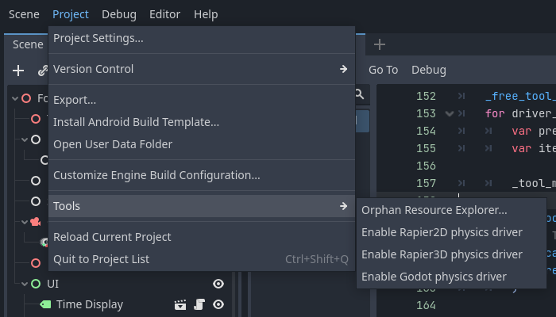
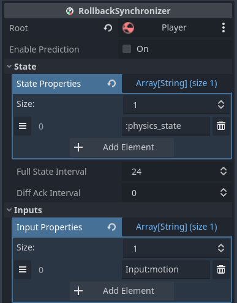

# Physics

At the time of writing official Godot releases have no support for manually
stepping physics simulations. As such if you want to use physics nodes with
rollback such as RigidBody you will need to run either a fork that supports
stepping or use an alternate physics addon that exposes stepping.

!!!tip
    An example game demonstrating physics and rollback is available: [Godot
    Rocket League].

## Known Options

- **Godot with Stepping PR**: Build the Godot editor and relevant export
  templates manually with the [physics stepping PR] applied. See the [Godot
  documentation] for compilation instructions.
- **Rapier Physics Addon**: A third-party 2D/3D physics engine for Godot with
  stepping support. Visit [godot.rapier.rs] for details.
- **Blazium Fork**: A Godot fork with enhanced physics features, including
  stepping. Learn more at [blazium.app].

!!!tip
    For using Godot with the Stepping Physics PR applied, a [community run
    repository] is available with a custom build. Note that this repository and
    its builds are provided as-is, and are not associated with Godot nor the PR's
    author.

## Enabling Physics Engine Rollback

To enable physics rollback, add the appropriate physics driver node to the root
of your scene tree based on your physics engine. Because stepping methods are
unavailable in standard Godot the classes are hidden to avoid compile errors.
You will need to enable them in the editor by going to *Project -> Tools ->
Enable physics driver*

- PhysicsDriver2D or PhysicsDriver3D for Godot’s default physics or Blazium.
- RapierPhysicsDriver2D or RapierPhysicsDriver3D for the Rapier Physics Addon.

These nodes disable Godot’s default physics processing and step the physics
simulation at **netfox**’s network tick rate.

## Physics Driver Configuration

**Physics Factor** -  Controls the number of physics steps per network tick.
For example, if your network tick rate is 30 Hz (one tick every ~33ms) but you
need a 60 Hz physics simulation for smoother collisions, set this to 2 to run
two physics steps per tick. 

**Rollback Physics Space** - When enabled, rolls back all physics objects in
the scene tree. Depending on how complex your scene tree is you may wish to
only rollback specific nodes for performance rather than the entire simulation
space.

## NetworkRigidBody

NetworkRigidBody2D and NetworkRigidBody3D nodes enable RigidBody
synchronization with RollbackSynchronizer, keeping clients in sync with the
server’s physics simulation. These nodes can replace standard RigidBody nodes
with some minor setup.

!!!note
    Avoid using StateSyncronizer with NetworkRigidBody, as it doesn't participate
    in rollback it will end up stepping faster than other nodes.

To make use of NetworkRigidBody you need to:

1. Configure your RollbackSynchronizer to include the NetworkRigidBody's
   `physics_state` as a state property.
2. Move physics-related logic from `_physics_process` to
   `_physics_rollback_tick`.

[Godot Rocket League]: https://github.com/albertok/godot-rocket-league
[community run repository]: https://github.com/albertok/godot/releases
[physics stepping PR]: https://github.com/godotengine/godot/pull/76462
[Godot documentation]: https://docs.godotengine.org/en/stable/contributing/development/compiling/index.html
[godot.rapier.rs]: https://godot.rapier.rs/
[blazium.app]: https://blazium.app/
