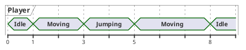
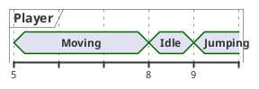

# RewindableStateMachine

Rollback-aware state machine implementation.

State machines are often used in games to implement different behaviors.
However, most implementations are not prepared for rollbacks. This class
provides an extensible implementation that can be used alongside a
[RollbackSynchronizer].

For a full example, see [multiplayer-state-machine].

## Creating a state machine

The first step is to add the RewindableStateMachine to your scene. It also
requires a RollbackSynchronizer that manages its `state` property. Unless these
conditions are satisfied, an editor warning will be displayed.

!!!note
    Editor warnings are only updated when the node tree changes. Configuration
    changes don't trigger an update. You may need to reload the scene after
    fixing a warning, or make a tree change, like deleting and re-adding a node
    by cutting and pasting.


Notice the RollbackSynchronizer added as a sibling to the
RewindableStateMachine, and having its `state` property configured.

## Implementing states

States are where the custom gameplay logic can be implemented. Each state must
be an extension of the RewindableState class, and added as a child to the
RewindableStateMachine.

States react to the game world using the following callbacks:

`tick(delta, tick, is_fresh)`
: Called for every rollback tick the state is active.

`enter(previous_state, tick)`
: Called when entering the state.

`exit(next_state, tick)`
: Called when exiting the state.

`can_enter(previous_state)`
: Called before entering the state. The state is only entered if this method
  returns true.

`display_enter(previous_state, tick)`
: Called before displaying the state.

`display_exit(next_state, tick)`
: Called before displaying a different state.

You can override any of these callbacks to implement your custom behaviors.

For example, the snippet below implements an idle state, that transitions to
other states based on movement inputs:

```gdscript
extends RewindableState

@export var input: PlayerInputStateMachine

func tick(delta, tick, is_fresh):
    if input.movement != Vector3.ZERO:
        state_machine.transition(&"Move")
    elif input.jump:
        state_machine.transition(&"Jump")
```

Transitions are based on *node names*, i.e. calling `transition(&"Move")` will
transition to a state node called *Move*. 


States must be added as children under a RewindableStateMachine to work.

## Using signals instead of classes

*RewindableState* nodes also emit signals during their lifetime. This enables
an alternate style of implementing states, by connecting handlers to different
signals. This can be useful if you want to keep all your logic in a single
script, among others.

Each of these signals correspond to a callback explained above:

* `on_enter()` → `enter()`
* `on_tick()` → `tick()`
* `on_exit()` → `exit()`
* `on_display_enter()` → `display_enter()`
* `on_display_exit()` → `display_exit()`

## Adding states

Once implemented, add the state nodes as children of the
*RewindableStateMachine* in the Scene Tree. When doing this programmatically,
make sure to set the state's `owner` to the target *RewindableStateMachine*.
Without the owner set, the *RewindableStateMachine* won't recognize the state.

## Display State vs State

There's two sets of callbacks for state transition - `enter()`/`exit()` and
`display_enter()`/`display_exit()`.

The `enter()`/`exit()` callbacks are intended for implementing game logic. The
`display_enter()`/`display_exit()` are intended for implementing presentation
logic - visuals, animations, sound effects, etc.

The same applies to `on_state_changed` vs. `on_display_state_changed`.

Let's take an example. The game is currently on tick @8. It needs to re-run
ticks @0 to @8 during rollback. In these ticks, the player moves a bit,
performs a jump, and then stops after moving a bit more:



This will trigger the following state changes:

* Tick@1: Idle → Moving
* Tick@3: Moving → Jumping
* Tick@5: Jumping → Moving
* Tick@8: Moving → Idle

For each of the above, the `on_state_changed` signal will be emitted, and the
`enter()`/`exit()` callbacks will be triggered.

This makes the above callbacks ideal for game logic, e.g. adding an upward
velocity to the player when they enter the `Jumping` state.

Note that the *displayed* state does not change. Before the rollback loop, the
player's state was `Idle`. After the rollback loop, the player's state is also
`Idle`. Even though the player has ran and performed a jump, it wouldn't make
sense to change their animation or play any sound effect.

Let's take a different rollback example:



In this case, the display state *did* change. Before the rollback loop, the
player's state was `Moving`. After the rollback loop, the player's state is
`Jumping`. It would make sense to change the player's animation and play a
jumping sound effect.

This can be done by using the display state callbacks - the
`on_display_state_changed` signal, and the `display_enter()`/`display_exit()`
methods.

## Caveats

RewindableStateMachine runs in the [rollback tick loop], which means that all
the [Rollback Caveats] apply.

In addition, rollback ticks are only ran for nodes that have known inputs for
the given tick, and *need* to be simulated - either on the server to determine
the new state, or on the client to predict. In practice, ticks are usually only
ran on the host owning state and the client owning inputs. The rest of the
peers use the state broadcast by the host.

**This means that transition callbacks are not always ran.** This is by design
and expected ( see [#327] ).

As a best practice, in the `enter()`, `exit()` callbacks and the
`on_state_changed` signal, only change game state - i.e. properties that are
configured as state in [RollbackSynchronizer].

To update visuals - e.g. change animation, spawn effects, etc. -, use either
the `on_display_state_changed` signal, or the `display_enter()` and
`display_exit()` callbacks to react to state transitions.

[multiplayer-state-machine]: https://github.com/foxssake/netfox/tree/main/examples/multiplayer-state-machine
[RollbackSynchronizer]: ../../netfox/nodes/rollback-synchronizer.md
[rollback tick loop]: ../../netfox/guides/network-rollback.md#network-rollback-loop
[Rollback Caveats]: ../../netfox/tutorials/rollback-caveats.md
[#327]: https://github.com/foxssake/netfox/issues/327#issuecomment-2491251374
