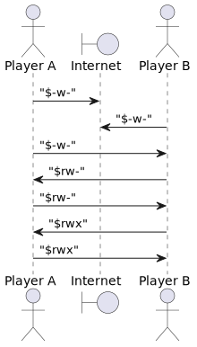

# PacketHandshake

Singleton implementing handshake over UDP.

The point of the handshake itself is to confirm two-way connection between
two parties - i.e. both parties can receive message from the other and 
receive acknowledgement from the other that their messages have arrived.

This is an important step before establishing connection for actual game 
play, as this lets both the client's and server's routers ( if any ) know 
that traffic is expected and should be let through.

## NAT punchthrough

Most players are behind a router. Routers are directly connected to the
internet, and protect machines behind them from unwanted traffic.

When routers receive packets from an unknown source, those packets are rejected
and don't reach the player's device. When data was sent to that address first,
routers see traffic as a reply and allow incoming data.

To take an example, if a random PC starts sending traffic your way, the router
will reject it. If you send data to the host behind godotengine.org, your
router will allow incoming traffic from it. Otherwise, you wouldn't be able to
open the website in your browser, as the incoming HTTP response would be
rejected.

This can be used to our advantage. If both players start sending traffic
towards eachother, eventually the routers will assume it's a response to some
request and allow the traffic.

> This is a very simplified description of how routers work. NAT punchthrough
> does not always work. For further reading, see [Network address translation].

## Handshake process

To confirm two-way connectivity, a string is sent back and forth, encoding the
player's knowledge about the connection:

The *Read flag* is set once we have received data from the other player.

The *Write flag* is set once we send data to the other player. Since data is
always sent, this flag is always set.

The *Duplex flag* is set when we have received data from the other player
knowing that they have also received data from us. This means that data flows
both ways.

The handshake process is successful when both players have the *Duplex flag*
set *and* both players know that the other player has the *Duplex flag* set.

Each flag is encoded as its specific character or a hyphen. The encoded string
is prepended with a dollar sign. For example:

* *$rw-* means that we have sent and received data from the other player
* *$rwx* means that the *read*, *write*, and *duplex* flags are all set

Here's the handshake process illustrated:

## Handshake over PacketPeer

To run the handshake over raw UDP, call `PacketHandshake.over_packet_peer`. The
specified PacketPeer will be used to send data until two-way connectivity is
confirmed or the timeout is reached. Between every packet sent, it takes a
short pause.

> *Note* that the PacketPeer must already be configured with a target address.

## Handshake over ENetConnection

If the game is already running, the handshake must be done over the already
active connection. For this case, use `PacketHandshake.over_enet`.

This connection can't be used to receive custom packets, only to send them. So
the target address will be spammed with traffic confirming two-way connectivity
until timeout. Handshake will always be considered successful.

If the connectivity exists, players will simply connect. Otherwise,
connectivity will fail as expected, regardless of the handshake results.

[Network address translation]: https://en.wikipedia.org/wiki/Network_address_translation
