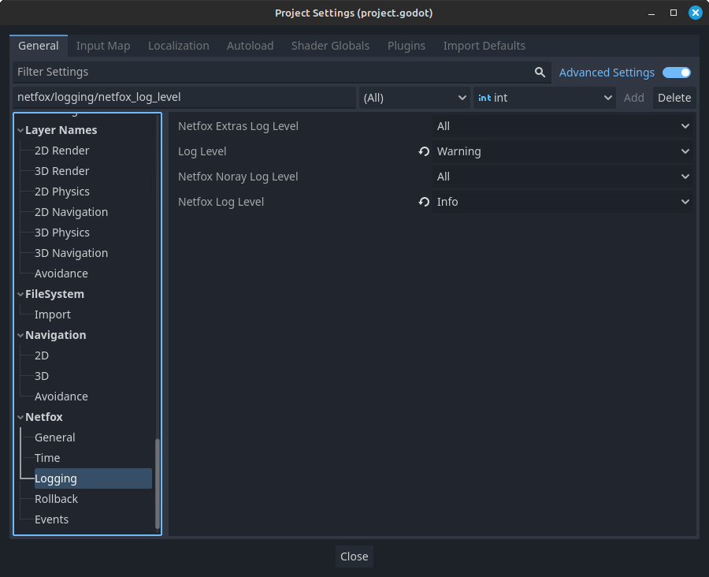

# Logging

During runtime, it can be useful to print some diagnostic info to the console -
this is called logging. The netfox addons include various log messages to help
with debugging. This is useful when running the game locally, but also helps if
there's log files players can attach with their bug reports.

Depending on your game, different logs may be needed. To accommodate this,
*netfox* can be configured to omit certain log messages.

## Log levels

Each log message can be in one of the following categories:

* Error
    * Something goes irrecoverably wrong, or something that should never happen
      just happened
* Warning
    * Something goes wrong, but can be handled
* Info
    * Useful information on expected behaviour
* Debug
    * Verbose messages, to help debug general code flow
* Trace
    * Extremely verbose messages, to help follow the code flow to the smallest detail

## Log messages

Log messages from any of the *netfox* addons are prefixed with log level, module and logging class / object:

```
[INF][netfox.noray::Noray] Trying to connect to noray at tomfol.io:8890
[DBG][netfox.noray::Noray] Resolved noray host to 172.105.69.73
[INF][netfox.noray::Noray] Connected to noray at 172.105.69.73:8890
[DBG][netfox.noray::Noray] Saved OID: 6JeDH07eVuFu5SO0p-6X2
[DBG][netfox.noray::Noray] Bound UDP to port 47769
[DBG][netfox.noray::Noray] Saved PID: vw6_N9sT2N0tXaYke9SV9ReWCgtdsOdfeL1o9zkCL93U7KzBjgMZ7hShBXpf_WYOB_TthARt4GfzH1iLxXR7iR3WCebzx9Sf108e8wUoqwTJqm9bIdVxyYoQUBFT9h2M
[INF][netfox.noray::Noray] Registered local port 47769 to remote
```

This makes it easier to gather info at a glance.

## Settings



These settings control the *minimum* log level - e.g. if the log level is set
to *info*, only messages at or above the info level will be logged, namely
info, warning and error. If the setting is set to *all*, all messages are
logged.

Log levels can be controlled globally and per addon. A message will be logged
if it passes *both* logging level checks.

For example, if the *Log Level* setting is at *Warning* and the *Netfox Log
Level* is at *Info*, only warning and error messages are logged for netfox.
This happens because the *Log Level* is more restrictive than the *Netfox Log
Level* setting.

Note that you don't need to install all netfox addons for the logging settings
to work. If an addon is not installed, its log level setting is simply ignored.
