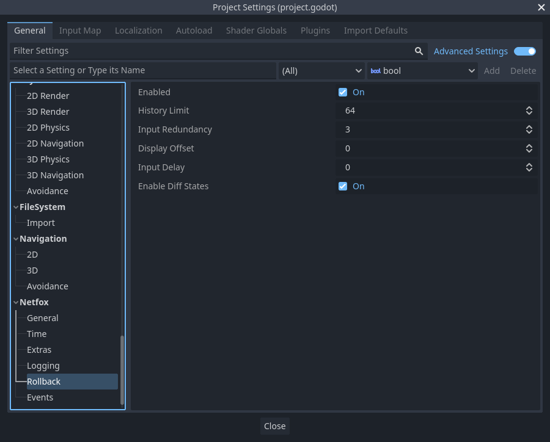

# NetworkRollback

Orchestrates the network rollback loop. Provided as an autoload.

Due to latency, the server may receive inputs from clients from multiple ticks
ago. Whenever this happens, the server rewinds its time and resimulates the
whole game from the time of the new input. The resimulated ticks are then sent
to clients to update their state.

Also due to latency, clients may receive a state from the server that is
several ticks old. Clients rewind their simulation to the time of the latest
received state and resimulate from there.

On both clients and servers, simulated states are recorded for reuse later.

Further reading: [Client-Side Prediction and Server Reconciliation]

Note that most of the time you do not need to use this class - the
[RollbackSynchronizer] node helps with writing rollback-aware behaviour.

## Network rollback loop

*NetworkRollback* runs the *network rollback loop* after every network tick,
but before the *after tick* signal is fired.

The following is the network rollback loop in isolation:

Signal handlers must implement the right steps for rollback to work.

During *before_loop*, all rollback-aware nodes must submit where to start the
resimulation, by calling `NetworkRollback.notify_resimulation_start`.
Resimulation will begin from the earliest tick submitted.

In each *on_prepare_tick(tick)* handler, nodes must rewind their state to the
specified tick. If a state is not available for the given tick, use the latest
tick that is earlier than the given tick. Nodes may also register themselves as
being simulated by calling `NetworkRollback.notify_simulated`. This is not used
by *NetworkRollback* itself, but can be used by other nodes to check which
nodes are simulated in the current rollback tick.

Before processing, *after_prepare_tick(tick)* is emitted. This is where any
additional state- or input preparation may happen, such as [input prediction].

For the *on_process_tick(tick)* signal, nodes must advance their simulation by
a single tick.

In *on_record_tick(tick)*, nodes must record their state for the given tick.
Note that since the simulation was advanced by one tick in the previous signal,
the *tick* parameter is incremented here.

The *after_loop* signal notifies its subscribers that the resimulation is done.
This can be used to change to the state that is appropriate for display.

The network rollback loop is part of the network tick loop as follows:

The rollback tick loop is triggered in the `NetworkTime.after_tick_loop`
signal. Since the rollback tick loop is the first thing connected to it, in
practice the rollback will run *before* any user code connected to the
`after_tick_loop` signal.

## Conditional simulation

During rollback, *NetworkRollback* loops over the full range of ticks to
resimulate. Some nodes may not need to be resimulated for the current tick,
e.g. because they don't have input for the current tick.

*NetworkRollback* can be used to track nodes that will be simulated in the
current rollback tick. Register nodes that will be simulated by calling
`NetworkRollback.notify_simulated`. To check if a node has been registered,
call `NetworkRollback.is_simulated`.

## Rollback-awareness

[RollbackSynchronizer] considers nodes rollback-aware that implement the
`_rollback_tick` method. Rollback-aware nodes are nodes that can participate in
the rollback process, i.e. they can resimulate earlier ticks.

To check if a node is rollback-aware, call `NetworkRollback.is_rollback_aware`.
To actually run a rollback tick on them, call
`NetworkRollback.process_rollback`.

These methods are called by [RollbackSynchronizer] under the hood.

## Input Submission Status

In certain scenarios you may wish to delay committing to something hard to
reverse like death, VFX or audio until its known for sure the outcome won't
change. One way of doing this is to check which nodes have submitted input and
are past a point of rollback.

You can query the status of Nodes with
`NetworkRollback.get_latest_input_tick(root_node)` or
`NetworkRollback.has_input_for_tick(root_node, tick)`. `root_node` being what
the relevant [RollbackSynchronizer] has configured.

All tracked nodes can be retrieved from
`NetworkRollback.get_input_submissions()` which will return the entire
`<root_node, latest_tick>` dictionary.

## Settings

*Enabled* toggles network rollback. No signals are fired when disabled.

*History limit* is the maximum number of recorded ticks to keep. Larger values
enable further rewinds and thus larger latencies, but consume more memory for
each node that is recorded.

*Input redundancy* This is the number of previous input ticks to send along with 
the current tick. We send data unreliably over UDP for speed. In the event a packet is
 lost or arrives out of order we add some redundancy. You can calculate your target
 reliability % packet success chance by using the formula 
 `1 - (1 - packet_success_rate) ^ input_redundancy`.

*Display offset* specifies the age of the tick to display. By displaying an
older state instead of the latest one, games can mask adjustments if a state
update is received from the server. The drawback is that the game will have
some latency built-in, as it reacts to player inputs with some delay. Setting
to zero will always display the latest game state.

*Input delay* specifies the delay applied to player input, in ticks. This
results in player inputs shifted into the future, e.g. if the player starts
moving left on tick 37, it will be sent to the server as tick 39. This way,
even if the input takes time to arrive, it will still be up to date, as long as
the network latency is smaller than the input latency.

!!!warning
    [RollbackSynchronizer]'s `is_fresh` parameter may not work as expected with
    input delay. This happens because clients already receive data for the
    current tick, which means that the tick doesn't need to be resimulated, and
    as a result, no `_rollback_tick` callbacks are ran with `is_fresh` set to
    true.

    This happens when network latency is smaller than the input delay.

*Enable diff states* toggles diff states. By sending only state properties that
have changed, netfox can reduce the bandwidth needed to synchronize the game
between peers. See [RollbackSynchronizer] on how this is done and configured.

[Client-Side Prediction and Server Reconciliation]: https://www.gabrielgambetta.com/client-side-prediction-server-reconciliation.html
[input prediction]: ../tutorials/predicting-input.md
[RollbackSynchronizer]: ../nodes/rollback-synchronizer.md
