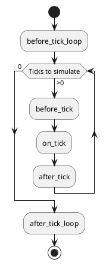
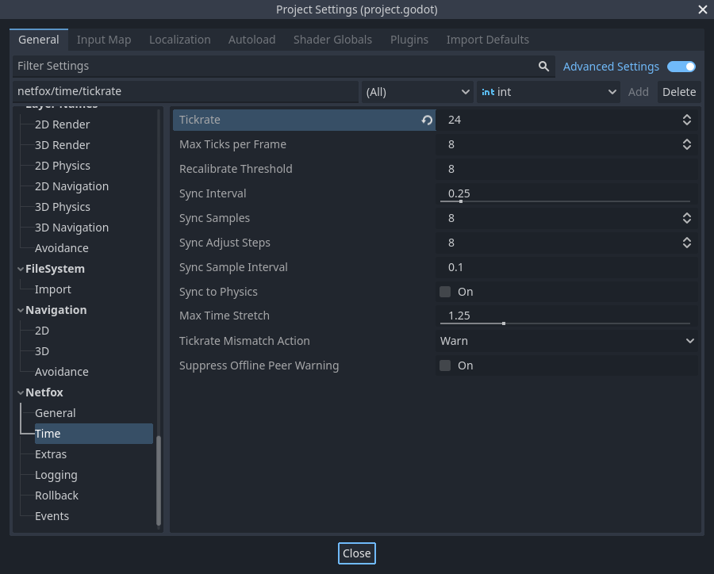

# NetworkTime

Tracks shared network time between players, and provides an event loop for
synchronized game updates. Provided as an autoload.

A separate timer is provided for network ticks, making the network game update
rate independent from rendering or physics frames.

## Network tick loop

*NetworkTime* provides its own independent event loop by exposing signals. This
makes networked game logic independent of current FPS, and makes it run at a
consistent rate. Connect handlers to *NetworkTime*'s signals to implement
networked game logic.

During each frame, *NetworkTime* checks how much time has elapsed since the
last tick loop. When more time has elapsed than a single tick's duration, the
*network tick loop* will run:



The tick loop will run as long as it catches up on ticks to run. Every loop is
limited to run at most `max_ticks_per_frame` ticks to avoid overwhelming the
CPU.

To tie the network tick loop to Godot's physics process, enable
`sync_to_physics`. This will result in the tick loop running a single tick in
every physics update.

To move your game logic to the network tick loop, use the *on_tick* event:

```gdscript
extends Node3D

@export var speed = 4.0

func _ready():
  NetworkTime.on_tick.connect(_tick)

func _tick(delta, tick):
  # Move forward
  position += basis.z * delta * speed
```

> By convention, *on_tick* handlers are named *_tick*.

## Starting and stopping

By default, *NetworkTime* does not run the tick loop at all. This lets you
control when the network tick loop, and thus the game starts and stops.

To start the tick loop, call the `NetworkTime.start()` coroutine. On servers,
this will start the tick loop and return immediately. On clients, it will first
synchronize the time to the server, start the network tick loop, and only then
return. Use this when starting the game.

> Starting the tick loop before starting multiplayer is not supported.

To stop the tick loop, call `NetworkTime.stop()`. This will immediately stop
the tick loop and return. Use this when the player leaves a game.

To get notified when a client successfully syncs their time and starts the tick
loop, use the `NetworkTime.after_client_sync(peer_id)` signal. This is fired
once per client, and only on the server.

## Pausing

*NetworkTime* also supports pausing the game, if needed. There's two cases
where pauses are considered.

When running ( and pausing ) the game from the editor, the network tick loop
is automatically paused. As there's currently no API to detect the editor
pausing the game, *NetworkTime* checks if Godot's `_process` delta and actual
delta is mismatching, and if so, considers the game paused. In some cases, this
can result in false positives when the game simply hangs for a bit, e.g. when
loading resources.

This pause detection only happens when the game is run from the editor, to
avoid false positives in production builds.

The other supported case is pausing the game from the engine itself. Whenever
`SceneTree.paused` is set to true, *NetworkTime* won't run the tick loop.

!!!warning
    Pausing the tick loop can cause desynchronization between peers, and could
    lead to clients fast-forwarding ticks to catch up, or time recalibrations.
    If the game is paused via SceneTree, it is recommended to pause and unpause
    at the same time on all peers.

## Tickrate matching

The idea of a shared time also implies matching tickrates. If one peer were to
run at a higher tickrate than the rest, that peer would inevitably get ahead in
ticks, and get out of sync. If it were to run at a lower tickrate, it would get
behind and out of sync.

For games where both the server and client are built from the same project,
this doesn't usually happen, since they share the same tickrate configuration.

If it does happen, by default it will be considered a configuration error, and
a warning will be emitted:

```
[WRN][@43][#1][_][netfox::NetworkTickrateHandshake] Local tickrate 24tps differs from tickrate of peer #1366785595 at 36tps! Make sure that tickrates are correctly configured in the Project settings! See netfox/Time/Tickrate.
```

This behavior is configurable, with the following options available:

Warn
:   Emit a warning about the tickrate mismatch, but do nothing. Useful for
    development.

Disconnect
:   Disconnect clients with mismatching tickrates. This is enforced by the
    host.

Adjust
:   Adjust the client's tickrate to match the host's.

Signal
:   Emit a signal about the detected mismatches, so custom behavior can be
    implemented.

See the [settings](#settings) for the appropriate configuration.

## Time synchronization

*NetworkTime* runs a time synchronization loop on clients, in the background.
Synchronizing time makes sure that all players have a shared idea of time and
can exchange timing-related data.

The synchronization itself is handled by [NetworkTimeSynchronizer].

*NetworkTime* provides different kinds of time, each for different use cases.
Each time can be accessed as ticks or seconds. Both advance after every network
tick.

### Synchronized time

* `NetworkTime.time`
* `NetworkTime.tick`

Marks the current network game time. This is continuously synchronized, making
sure that these values are as close to each other on all peers as possible.

Use this whenever a notion of game time is needed.

### Local time

!!! warning
    *Deprecated since netfox v1.9.0.* Use [synchronized time] instead.

* `NetworkTime.local_time`
* `NetworkTime.local_tick`

Marks the current time in reference to the local machine. Starts at zero when
the network tick loop starts.

Useful for logic that is tied to the tick loop, but is not synchronized over
the network. A good example is visual effects.

Not suitable for synchronizing data, as the local time is different at each
player.

### Remote time

!!! warning
    *Deprecated since netfox v1.9.0.* Use [synchronized time] instead.

* `NetworkTime.remote_tick`
* `NetwokrTime.remote_time`
* `NetworkTime.remote_rtt`

Marks the current *estimated* time of the server. This is a regularly updated
estimate.

Note that on each update, the remote time may jump forwards or even backwards.

The estimate is based on the measured roundtrip time ( *remote_rtt* ) and the
assumption that the latency is exactly half of that.

Can be used as a base for comparisons ( e.g. latency ), but *not recommended*
for tying game logic to it.

To get notified when a time synchronization happens and the remote time is
updated, use the `NetworkTime.after_sync` signal.

## Settings

Settings are found in the Project Settings, under Netfox > Time:



*Tickrate* specifies the number of ticks every second in the network tick loop.

*Max Ticks Per Frame* sets the maximum number of frames to simulate per tick loop. Used to avoid freezing the game under load.

*Recalibrate Threshold* is the largest allowed time discrepancy in seconds. If
the difference between the remote clock and reference clock is larger than this
setting, the reference clock will be reset to the remote clock. See
[NetworkTimeSynchronizer] for more details.

*Stall Threshold* is the amount of time in seconds that can pass between two
frames until it is considered a stall. This is used to detect game freezes or
OS-level pauses ( e.g. the window gets minimized ). If a stall is detected, it
is compensated by adjusting the game clock.

*Sync Interval* is the resting time in seconds between sampling the remote
clock.

*Sync Samples* is the number of measurements to use for time synchronization.
This includes measuring roundtrip time and estimating clock offsets.

*Sync Adjust Steps* is the number of iterations to use when adjusting the
reference clock. Larger values result in more stable clocks but slower
convergence, while smaller values synchronize more aggressively.

*Sync Sample Interval* *deprecated in netfox v1.9.0*. Originally used as the
resting time between roundtrip measurements.

*Sync to Physics* ensures that the network tick loop runs in Godot's physics
process when enabled. This can be useful in cases where a lot of physics
operations need to be done as part of the tick- or the rollback loop.

*Tickrate Mismatch Action* indicates what to do when a tickrate mismatch is
detected. See [Tickrate matching](#tickrate-matching) on what the individual
options do.

*Suppress Offline Peer Warning* suppresses warning when `NetworkTime.start()` is
called with the active [multiplayer peer] being an [OfflineMultiplayerPeer]. In
most cases, this warning means that the tick loop was unintentionally started
before connecting to a game or hosting one. When this settings is enabled, the
warning is not printed, instead assuming the [OfflineMultiplayerPeer] is
intentional.

[NetworkTimeSynchronizer]: ./network-time-synchronizer.md
[synchronized time]: #synchronized-time
[multiplayer peer]: https://docs.godotengine.org/en/stable/classes/class_multiplayerapi.html#class-multiplayerapi-property-multiplayer-peer
[OfflineMultiplayerPeer]: https://docs.godotengine.org/en/stable/classes/class_offlinemultiplayerpeer.html#class-offlinemultiplayerpeer
