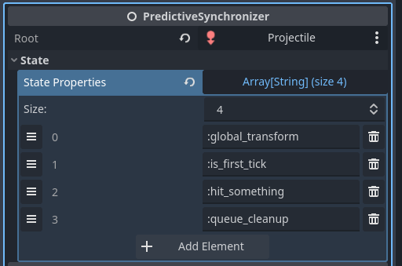

# PredictiveSynchronizer

An un-networked version of [RollbackSynchronizer] which manages states during the rollback
loop. It's main use case is for short lived or highly deterministic scenarios where using
[RollbackSynchronizer] isn't practical or necesary.

## Key Differences from RollbackSynchronizer

Same same, but different.
- **No networking** - Operates entirely locally
- **No input properties** - Only manages state properties
- **Different rollback function** - Uses `_predict_tick` instead of `_rollback_tick`


## Configuration

### Basic Setup

Add PredictiveSynchronizer as a child to your target node and configure:



### Root Node

The *Root* property specifies the root node for resolving state properties.
Following the same pattern as [RollbackSynchronizer], it's recommended to add
PredictiveSynchronizer under its target node, making the parent the root.

### State Properties

*State properties* are recorded for each tick and restored during rollback,
just like in [RollbackSynchronizer]. The key difference is that these states
are only managed locally - they're never transmitted across the network.

See [Property paths] for details on specifying properties.

## Writing Prediction-Aware Scripts

PredictiveSynchronizer automatically discovers nodes with a `_predict_tick` method
under the specified root. During rollback, it will call that method for each tick.

Implement `_predict_tick` in your scripts:

```gdscript
extends ShapeCast3D

@export var projectile_speed: float = 50.0

func _predict_tick(delta: float, tick: int, is_fresh: bool):

	shape_cast.force_shapecast_update()

	if is_colliding():
		handle_collision()

	global_position += transform.basis.z.normalized() * projectile_speed
```
