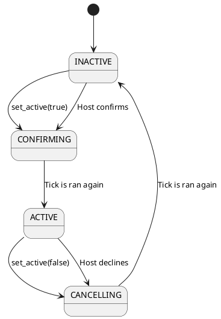

# RewindableAction

!!!warning
    RewindableActions are *experimental*, meaning the API may change in
    breaking ways, and may be less stable than other features.

    Once the class matures and finds its final form, the *experimental* mark
    will be removed. Feedback is welcome in the meanwhile!

Synchronizes events that happen over the network, by letting peers predict the
event happening, and then adjusting the game based on the host's response.

For example, *RewindableActions* could be use to synchronize gun shots
implemented as part of the rollback tick loop. This is implemented in the
[rollback-fps] example.

## Using RewindableActions

To use *RewindableActions*, add them as nodes to your scenes. Once that's done,
grab a reference to them from your scripts as you would for any other node -
e.g. by using its NodePath, or by @export-ing it as a variable:

```gdscript
@onready var rewindable_action := $RewindableAction as RewindableAction
@export var rewindable_action: RewindableAction
```

### Predicting events

All peers ( both hosts and clients ) should run the same simulation in their
`_rollback_tick` implementations. During the rollback tick, peers should
determine whether they think an event happens by calling
`RewindableAction.set_active()` - e.g. if they think the gun was fired they should
call `RewindableAction.set_active(true)`, otherwise call
`RewindableAction.set_active(false)`.

The *RewindableAction* will keep track of the changes caused by `set_active()`.
Clients ( i.e. peers *not* owning the *RewindableAction* ) will wait for the
host ( i.e. peer owning the *RewindableAction* ) to broadcast the ground truth,
noting when did the event happen, and when did it not.

!!!note
    Not calling `set_active()` on a specific tick means no prediction for that tick
    will be synchronized, potentially leading to desyncs.

### Performing events

With the above, *RewindableAction* will synchronize *when* something happens,
but *what* should happen is up to the game logic.

For each rollback tick, to figure out what should happen, the `get_status()`
method will return one of the following values:

`RewindableAction.INACTIVE`
:   The event hasn't happened yet.

`RewindableAction.ACTIVE`
:   The event has already happened, and this is not the first time its logic
    will run.

`RewindableAction.CONFIRMING`
:   The event was just set to active in this tick.

`RewindableAction.CANCELLING`
:   The event was just set to inactive in this tick.

See the following graph for a better understanding of how a *RewindableAction*
transitions from one state to another:



Keeping with the gunfire example, if the status is `ACTIVE` or `CONFIRMING`,
make sure to perform the firing logic - e.g. do a hitscan, and decrease the
health of the player hit. In other words, make sure to update the *game state*.

If the state is `CONFIRMING`, implement logic that may spawn other objects (
e.g. a bullet hole when hitting a wall ).

If the state is `CANCELLING`, undo any logic ran in `CONFIRMING`.

Usually no extra code is necessary for `INACTIVE`, since the game state update
can simply be skipped, and other related code is ran in
`CONFIRMING`/`CANCELLING`.

### Reacting to status changes

Without [mutations], nodes are not always re-ran for every tick during
rollback. To make sure that rollback code is ran when the *RewindableAction*'s
status changes, use `mutate()` to register the appropriate nodes to be
*mutated* if the action's status changes, e.g.:

```gdscript
@onready var rewindable_action := $RewindableAction as RewindableAction

func _ready():
  rewindable_action.mutate(self)

func _rollback_tick(delta, tick, is_fresh):
  rewindable_action.set_active(...)
```

### Remembering things between tick loops

*RewindableActions* also provide the concept of *context*. This is any
arbitrary value that the *RewindableAction* will remember for the given tick,
even throughout tick loops.

The *context* value can be set and retrieved by the user.

For example, *context* can be used for weapons to remember the projectile they
have spawned. If the action transitions to `CANCELLING`, the *context* can be
used to remember which projectile was spawned in that tick, and in turn, which
projectile needs to be destroyed.

Use `has_context()` to check if there's any context set, `get_context()` to
retrieve it, `set_context()` to update the *context* value, and
`erase_context()` to forget it.

## Handling visuals and effects

Performing events ( e.g. a gunshot ) often includes not just updates to the
game state ( like decreasing health ), but also visual- and audio effects to
communicate what's happening to the player.

Since a rollback tick loop may run multiple ticks in a single frame, simply
playing sounds and other effects from the rollback tick loop can end up
spamming particles and playing the same sound effects many times on the same
frame.

Instead, one approach would be to check whether the event has happened at the
end of each tick loop, and if so, play the appropriate sounds and run the
appropriate effects.

Use `has_confirmed()` to check if the action has been confirmed since the
beginning of the last tick loop ( i.e. had the `CONFIRMING` status ), and
`has_cancelled()` to check if the action has been cancelled.

For example:

```gdscript
@onready var fire_action := $"Fire Action" as RewindableAction

func _ready():
	NetworkTime.after_tick_loop.connect(_after_loop)
	# ...

func _after_loop():
	if fire_action.has_confirmed():
		sound.play()
```

[rollback tick loop]: ../guides/network-rollback.md
[rollback-fps]: https://github.com/foxssake/netfox/tree/main/examples/rollback-fps
[mutations]: ../tutorials/modifying-objects-during-rollback.md
