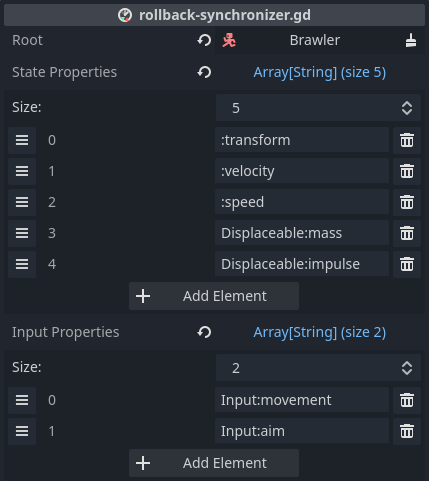

# RollbackSynchronizer

Manages state during the network rollback loop by hooking into
[NetworkRollback] events. Simulates nodes as required during rollback.

To read more on best practices, see [Rollback caveats].

## Configuring state and input

To use *RollbackSynchronizer*, add it as a child to the target node, specify
the root node, and configure which properties to manage:



*Root* specifies the root node for resolving state and input properties. Best
practice dictates to add *RollbackSynchronizer* under its target, so *Root*
will most often be the *RollbackSynchronizer*'s parent node.

*State properties* are recorded for each tick and restored during rollback. For
state, the server is the ultimate authority. Make sure that nodes containing
state properties are owned by the server.

*Full state interval* specifies how many ticks to wait between full states. If
diff states are enabled, full states are only sent at specific intervals, to
make sure that peers always have the correct state data. *Only considered if
diff states are enabled.*

*Diff ack interval* specifies how many ticks to wait between acknowledging diff
states. Setting this to lower non-zero values may result in more bandwidth
savings on non-changing properties, but this can be outweighed by the increased
number of ack messages. *Only considered if diff states are enabled.*

See [diff states](#diff-states) for more on how the above two settings are
used.

*Input properties* are gathered for each player and sent to the server to use
for simulation. Make sure that nodes containing input properties are owned by
their respective players.

See [Property paths] on how to specify properties.

*Enable input broadcast* toggles whether input properties are broadcast to all
peers, or only to the server. The default is *true* to support legacy
behaviour. It is recommended to turn this off to lower bandwidth and lessen the
attack surface for cheating.

> *Note* that it is not recommended to have both state and input properties on
> the same node. Since nodes with state belong to the server, and nodes with
> input belong to the player, it is difficult to separate ownership on the same
> node.

## Writing rollback-aware scripts

During setup, *RollbackSynchronizer* finds all the rollback-aware nodes under
the specified *root*. During rollback, it will call all the rollback-aware
nodes to simulate new state.

To learn about rollback-awareness, see [NetworkRollback].

In short, implement `_rollback_tick` in your scripts:

```gdscript
extends CharacterBody3D

@export var speed = 4.0
@export var input: PlayerInput

func _rollback_tick(delta, tick, is_fresh):
  velocity = input.movement.normalized() * speed
  velocity *= NetworkTime.physics_factor

  move_and_slide()
```

## Single fire events

The first time a rollback tick is processed, the `is_fresh` parameter is set to
`true`. This can be used to trigger animations or sounds without them being
repeated each rollback event.

For example to improve the client side experience a spell or weapon can play
its activating sounds and animation immediately and then proceed to complete
the action once server confirmation is received.

## Changing configuration

*RollbackSynchronizer* has to do some setup work whenever the state or the
input properties change.

By default, this work is done upon instantiation. If you need to change state
or input properties during runtime, make sure to call `process_settings()`,
otherwise *RollbackSynchronizer* won't apply the changes.

While changing configuration after instantiation is possible, it is not
recommended. You may get away with it if the configuration change happens in a
few ticks after instantiation. For longer periods, experiment at your own risk.

## Changing ownership

The setup work above is also needed whenever the multiplayer authority changes
of any of the nodes that have a state- or input property.

Changing authority during gameplay is supported. Make sure to call
`process_authority()` on all peers at the same time, to ensure they're on sync
about ownership.

This method is called automatically during instantiation and whenever
`process_settings()` is called.

---

When *only* multiplayer authority changes, call `process_authority()`. When the
configured state- or input properties change ( i.e. different properties need
to be synced ), call `process_settings()`.

## Diff states

When diff states are enabled in the [rollback settings], netfox will attempt to
save bandwidth by only sending state properties that have changed.

These changes are always based on a tick that the receiving peer has confirmed
it already has. Basically we don't want to send changes compared to a tick that
the peer has no knowledge about.

Peers notify the host of which ticks they know about by *acknowledging* ( or
ack'ing ) ticks. This acknowledging has two flavors.

The first flavor is *full states*. These states contain all the state data,
regardless of what changed and what has stayed the same. These ensure that
peers have all the state data for a given tick. Once a full state is received,
the receiving peer acknowledges that tick over a reliable channel.

The second flavor is *diff states*. Peers may also acknowledge ticks after
receiving a diff state, meaning that they have reconstructed the given state
from a known earlier state and the diff state received. These are acknowledged
over an unreliable channel. By using an unreliable channel, we can acknowledge
diff states more often without causing any hiccups in network traffic.

When diff states are disabled, netfox will always send full state data for all
ticks.

[Rollback caveats]: ../tutorials/rollback-caveats.md
[NetworkRollback]: ../guides/network-rollback.md
[Property paths]: ../guides/property-paths.md
[rollback settings]: ../guides/network-rollback.md#settings
