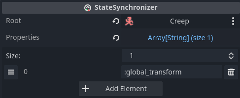

# StateSynchronizer

Synchronizes state from the node's authority to other peers.

Similar to Godot's [MultiplayerSynchronizer], but is tied to the [network tick
loop]. Works well with [TickInterpolator].

One way to use this node is to synchronize logic that runs only on the server,
for example NPC's in your games. The NPC's are controlled fully by the server,
and their state is synchronized to the clients by the *StateSynchronizer*
nodes.

## Configuring state

To use *StateSynchronizer*, add it as a child to the target node, specify the
root node, and configure which properties to synchronize:

*Root* specifies the root node for resolving properties. Best practice dictates
to add *StateSynchronizer* under its target, so *Root* will most often be the
*StateSynchronizer*'s parent node.

*Properties* are recorded for each tick on the node's authority ( usually the
server ), and broadcast to other peers. These are analogous to
[RollbackSynchronizer]'s *state properties*.

See [Property paths] on how to specify properties.

## Changing configuration

*StateSynchronizer* has to do some setup work whenever the state or the
input properties change.

By default, this work is done upon instantiation. If you need to change
properties during runtime, make sure to call `process_settings()`, otherwise
*StateSynchronizer* won't apply the changes.

You can change the node's authority without calling `process_settings()` again.
Make sure that the authority is changed the same way on all peers, to avoid
discrepancies.

## When to use StateSynchronizer and MultiplayerSynchronizer

Part of the design philosophy of netfox is to build *on top of* Godot's
networking tools, instead of *replacing* them.

Both [MultiplayerSynchronizer] and StateSynchronizer can be used to synchronize
state from authority to the rest of the peers.

[MultiplayerSynchronizer] uses its own timer, and is independent of netfox's
[network tick loop]. It can also do delta updates, and manage visibility per
peer. Since it is not tied to netfox's tick loop, it does not work with
[TickInterpolator].

StateSynchronizer records all the properties specified and broadcasts them
as-is to all peers. This does not include visiblity or delta updates. The
broadcast happens on every network tick. This node is explicitly designed to
work with [TickInterpolator].

---

You can use StateSynchronizer for properties that you want to be interpolated,
like position, rotation, or any other visual properties.

You can use [MultiplayerSynchronizer] for properties that either don't need
interpolation ( e.g. a unit's HP ), or specifically need one of
[MultiplayerSynchronizer]'s features.

[MultiplayerSynchronizer]: https://docs.godotengine.org/en/stable/classes/class_multiplayersynchronizer.html
[network tick loop]: ../guides/network-time.md
[TickInterpolator]: ./tick-interpolator.md
[RollbackSynchronizer]: ./rollback-synchronizer.md
[Property paths]: ../guides/property-paths.md
