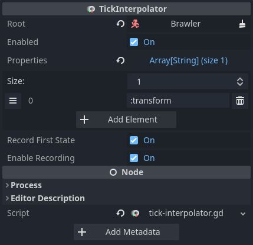

# TickInterpolator

Interpolates between network ticks to smooth out motion.

Uses [Interpolators] under the hood to support various data types. To read more
on best practices, see [Interpolation caveats].

## Configuring interpolation

To use *TickInterpolator*, add it as a child to the target node, specify the
root node, and configure which properties to interpolate:



*Root* specifies the root node for resolving *Properties*. Best practice
dictates to add *TickInterpolator* under its target, so *Root* will most often
be the *TickInterpolator*'s parent node.

*Properties* specify which properties to interpolate. See [Property paths] on
how to specify these values.

*Record First State* will make *TickInterpolator* take a snapshot when the Node
is instantiated. This snapshot will be used for interpolation, instead of
waiting for the next network tick. Useful for objects which start moving
instantly upon entering the scene tree, like projectiles.

*Enable Recording* toggles automatic state recording. When enabled,
*TickInterpolator* will take a new snapshot after each network tick loop and
interpolate towards that. Disabling this will require you to manually call
`push_state()` whenever the *properties* are updated.

## Sudden changes

When a node makes a sudden change, like teleporting from one place to another,
interpolation may not be desired.

Call `teleport()` in these cases to avoid interpolation and just jump to the
current state. Interpolation will resume after the current state.

Example:

```gdscript
func _tick(tick, delta):
  # Respawn after a while
  if _tick == respawn_tick:
    # Jump to spawn point, without interpolation
    position = spawn_position
    $TickInterpolator.teleport()
```

## Changing configuration

*TickInterpolator* has to do some setup work whenever the interpolated
properties change, e.g. when a new property needs to be interpolated.

By default, this work is done upon instantiation. If you need to change
interpolated properties during runtime, make sure to call `process_settings()`,
otherwise *TickInterpolator* won't apply the changes.

[Interpolators]: ../guides/interpolators.md
[Interpolation caveats]: ../tutorials/interpolation-caveats.md
[Property paths]: ../guides/property-paths.md
