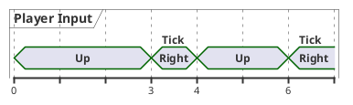
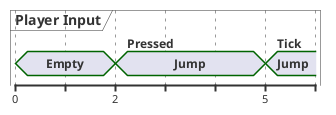
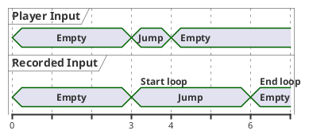

# Input gathering tips and tricks

In the [Responsive player movement] tutorial, we've seen a basic example on how
to gather input. This tutorial will elaborate on how input gathering works
under the hood, and how that affects some common input patterns in games.

!!!note
    You can find the full project [in the repository].

## Understanding input gathering

To have a shared notion of time, *netfox* provides its own time synchronization
and a *tick loop*. The *tick loop* will check how much time has passed since
the last network tick, and will run as many ticks as needed to catch up. Most
often this is a single tick every few frames, but in special cases it might
need to run multiple ticks in a single loop.

To have input available for each tick, *RollbackSynchronizer*s record input
after every network tick.

Since multiple ticks may be ran in a single tick loop, it makes no sense to
gather input for each tick - the hardware wouldn't update, since the ticks are
run one after the other.

Instead, input is gathered *before* each tick loop, and then reused for each
tick in the loop. This explains why special measures need to be taken in some
cases.

To read more about *netfox*'s *tick loop*, see the [Network tick loop].

## Continuous inputs

Consider player movement - if the player holds the button *up*, the character
will move north, right for east, *down* for south, *left* for west. If the
player holds two directions, the character will move diagonally.

Since the player needs to *hold* the buttons for movement to happen, it is
considered a *continuous* input.

Checking the inputs pressed at the point of gather works:

```gdscript
extends BaseNetInput
class_name PlayerInput

var movement: Vector3 = Vector3.ZERO

func _gather():
  movement = Vector3(
    Input.get_axis("move_west", "move_east"),
    Input.get_action_strength("move_jump"),
    Input.get_axis("move_north", "move_south")
  )
```

However, consider what happens if inputs change between two ticks. Let's
visualize one such case on a timeline:



Even though the player alternated between pressing Up and Right, only Right was
recorded as an input. This is gets worse considering that the player was
pressing Up *the majority of the time*.

The solution is to sample player input on every `_process()` frame, and average
the samples collected before each tick loop.

```gdscript
--8<-- "examples/snippets/input-gathering-tutorial/continuous-sampled-input.gd"
```

This way, every known input is taken into account.

This method shines the best in cases where the network tickrate is considerably
lower than the actual FPS at which the game runs. For example, in case the
network tick loop runs at 30 ticks per second, but the game consistently runs
and renders at 60fps, or even more.

With 30tps and 60fps, we take on average two input samples per tick.

## One-off inputs

Depending on game design, there are cases where the game needs the player to
press a button to take an action. If the button is held, the action still
happens only once, as it was pressed only once. If the player needs to perform
the action multiple times, they need to press the relevant button multiple
times.

These are considered *one-off inputs*.

Godot provides methods such as [Input.is_action_just_pressed()] to check if a
given input was just pressed. Counterintuitively, this does not work as
expected - the method recognizes the current frame ( `_process` ) or physics
tick ( `_physics_process` ), but not *netfox* ticks. Let's see it on a
timeline:



Even though the input was pressed on frame 2, input gathering only ran on frame
5, by which time the input is *held*, not *just pressed*. This means, that the
*just pressed* check will only register if the player manages to press the
button on the exact same frame as the input gathering is running.

A different issue pops up when the game slows down a bit, and *netfox* needs to
run multiple ticks in a single loop to catch up. Let's visualize this with a
timeline, showing both the user input in real-time, and what netfox records as
input:



The player pressed Jump on a single frame, which was recorded. Then, this
single recorded input was used for each tick in the tick loop. Resulting in the
player trying to jump for multiple ticks, even though they pressed the button
only on a single frame.

To solve both of these issues, *one-off inputs* can be buffered similarly to
*continuous inputs*. The difference is that we reset the input value after it's
gathered - this way, the input will be true for *at most* a single tick:

```gdscript
--8<-- "examples/snippets/input-gathering-tutorial/one-off-input.gd"
```

!!!tip
    The same principle of using buffer variables and accumulating input samples
    can be implemented in the `_input()` callback as well.


[in the repository]: https://github.com/foxssake/netfox/tree/main/examples/input-gathering
[Responsive player movement]: ./responsive-player-movement.md
[Network tick loop]: ../guides/network-time.md#network-tick-loop
[Input.is_action_just_pressed()]: https://docs.godotengine.org/en/stable/classes/class_input.html#class-input-method-is-action-just-pressed

