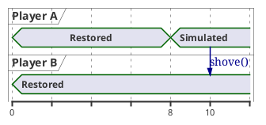
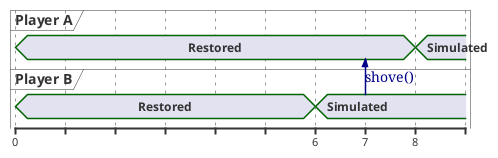
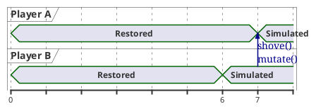

# Modifying objects during rollback

There are cases where two objects interact and modify each other during
rollback. For example:

* Players shoving another
* An explosion displacing objects around it
* Two cars colliding
* A player shooting at another - if player stats are managed as part of
  rollback

## Using Mutations

!!!warning
    Mutations are *experimental*, meaning the API may change in breaking ways,
    and may be less stable than other features.

    Once the API matures and finds its final form, the *experimental* mark will
    be removed. Feedback is welcome in the meanwhile!

Mutations enable modifying objects during rollback, in a way that is taken into
account by netfox.

When an object is modified during rollback, call `NetworkRollback.mutate()`,
passing said object as an argument.

As a result, the changes made to the object in the current tick will be
recorded. Since its history has changed, it will be resimulated from the point
of change - i.e. for all ticks after the change was made.

!!!note
    Make sure that `mutate()` is only called on objects that need it - otherwise,
    ticks will be resimulated for objects that don't need it, resulting in worse
    performance.

### Example code

To see this in action, take a snippet from Forest Brawl:

```gdscript
    for brawler in _get_overlapping_brawlers():
        var diff := brawler.global_position - global_position
        var f := clampf(1.0 / (1.0 + diff.length_squared()), 0.0, 1.0)

        var offset := Vector3(diff.x, max(0, diff.y), diff.z).normalized()
        offset *= strength_factor * strength * f * NetworkTime.ticktime
        
        brawler.shove(offset)
        NetworkRollback.mutate(brawler)
```

The script calculates which direction to shove the player in, and with what
force. This is then applied by calling `shove()`. 

Then, on the last line, these changes are saved by calling
`NetworkRollback.mutate(brawler)`.

Calling `mutate()` is all that's needed to use this feature.

## The problem with naive implementations

The simplest way to implement these mechanics is to just update the affected
object, without using mutations. For example, when one player shoves another,
the shove direction can simply be added to the target player's position. Doing
this will not work unfortunately.

Let's say that Player A is shoving Player B. With Player A being the local
player, we have input for its actions. With Player B being a remote player, it
won't be simulated. So even though its position was modified, this change will
not be recorded, and will be overridden by its last *known* position.



In the example above, even though Player A shoved Player B on tick 10, Player B
is not simulated in that given tick, so it won't be recorded. Player A's shove
is not saved to history.

This may partially be fixed by enabling [prediction] for players.

Take another case, where Player B wants to shove Player A. With Player B being
a remote player, we only receive its input a few ticks after the fact. So we
need to resimulate Player B from an earlier tick. In one of these earlier tick,
Player A gets shoved.



In this example, we've received input for Player B for tick 6 onwards. On tick
7, Player B shoves Player A. Since we've already simulated Player A for the
given tick, we don't need to simulate it again. This means that any changes for
the tick will not be recorded. The shove will not be saved to history.

Since Player A was already simulated and recorded for this earlier tick, it
being shoved will not be recorded.

In both cases, we need to use mutations to tell netfox that a given object has
been modified ( *mutated* ), and its state history should be updated.

Let's try the previous example, but now with `mutate()` added:



Player A will be resimulated from the point of shoving, and the shove itself
will be recorded.

[prediction]: ./predicting-input.md
