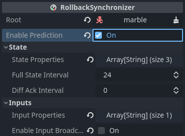

# Predicting input

Whenever clients send their inputs, it takes some time to arrive. From there,
it also takes time for the updated game state to arrive to clients.

This means that the server never knows the client's *current* input, only the
input from a few ticks ago - depending on network latency. Other clients are
even more behind, as they also need to wait for the server to broadcast the
updated game state.

Another trick *netfox* enables to hide this latency is *input prediction*.

## About prediction

By default, nodes are only simulated for ticks that we currently have enough
information for - i.e. the *input* for the current tick. If there's no input,
the node simply isn't simulated, as we can't know what the player intended to
do.

But, what if we do know? Or what if we can make a reasonable guess?

For example, in driving games, it is a safe assumption that if the player was
going full throttle three ticks ago, they are still going full throttle.

It is important to consider the last received input's *age*. The more time
passes, the harder it is to reasonably predict the player's inputs.

*Prediction* allows users to implement similar, game-specific predictions.

## Implementing input prediction

`NetworkRollback` provides the following signal:

```gdscript
signal after_prepare_tick(tick: int)
```

This is emitted during rollback, *after* the input and state is applied for the
tick about to be simulated. This is the phase where input prediction may
happen.

Firstly, call `RollbackSynchronizer.is_predicting()`, to check if any
prediction needs to be done. If none, input can be left as-is, without
predicting.

You may also check if there's *any* known input for the current tick that we
can base our prediction off of. This is done by calling
`RollbackSynchronizer.has_input()`.

For the actual prediction, consider the age of the last known input. This is
obtained by calling `RollbackSynchronizer.get_input_age()`, which will return
the applied input's age in ticks.

---

To put all of this into practice, see the following snippet:

```gdscipt
extends BaseNetInput

var movement: Vector3
var confidence: float = 1.

@onready var _rollback_synchronizer := $"../RollbackSynchronizer" as RollbackSynchronizer

func _ready():
	super()

	# Predict on `after_prepare_tick`
	NetworkRollback.after_prepare_tick.connect(_predict)

func _gather():
	# Gather input
	movement = Vector3(
		Input.get_axis("move_east", "move_west"),
		Input.get_action_strength("move_jump"),
		Input.get_axis("move_south", "move_north")
	)

func _predict(_t):
	if not _rollback_synchronizer.is_predicting():
		# Not predicting, nothing to do
		confidence = 1.
		return
	
	if not _rollback_synchronizer.has_input():
    # Can't predict without input
		confidence = 0.
		return
	
	# Decay input over a short time
	var decay_time := NetworkTime.seconds_to_ticks(.15)
	var input_age := _rollback_synchronizer.get_input_age()
	
	# **ALWAYS** cast either side to float, otherwise the integer-integer 
	# division yields either 1 or 0 confidence
	confidence = input_age / float(decay_time)
	confidence = clampf(1. - confidence, 0., 1.)

	# Modulate input based on confidence
	movement *= confidence
```

In this example, a confidence value is calculated based on the input age. This
is then used to gradually fade out the input, as if the player slowly let go of
the controls.

Make sure to consider the specifics of your game and tailor your input
prediction strategy to the game's needs. Depending on the game, you may even
opt out of prediction.

## Impossible predictions

In the example above, a *confidence* value of zero means that input simply
can't be predicted currently. This usually happens when the input is too old to
use for prediction.

In this case, call `NetworkRollback.ignore_prediction(target)`. This lets
*netfox* know that the target node - usually `self` - can't be predicted. Its
simulated state will not be recorded for the current tick.

To see this in practice:

```gdscript
func _rollback_tick(dt, _t, _if):
	if is_zero_approx(input.confidence):
		# Can't predict, not enough confidence in input
		_rollback_synchronizer.ignore_prediction(self)
		return

	# ... run simulation as usual ...
```

If there's not enough confidence in the input, `ignore_prediction` is called,
and we return early.

!!! note
    `NetworkRollback.ignore_prediction()` can be called for multiple nodes from
    the same script. This is useful in cases where a single script drives
    multiple nodes, like an FPS controller updating the whole body's position
    and the head's rotation independently.

## Configuring prediction

Running the game in its current state would result in no changes - *prediction
is off by default*. It can be toggled separately for each
`RollbackSynchronizer`.

To enable, check *Enable Prediction* in the `RollbackSynchronizer`'s
configuration:



With this configured, `RollbackSynchronizer` will simulate all the nodes it
manages even for ticks that *it doesn't have input for*.

## Example project

To see all of the above as one cohesive project, see the [Input prediction example].

[Input prediction example]: https://github.com/foxssake/netfox/tree/main/examples/input-prediction
