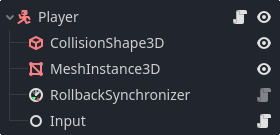
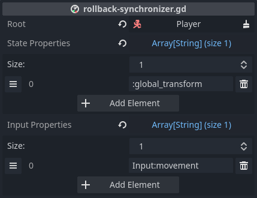
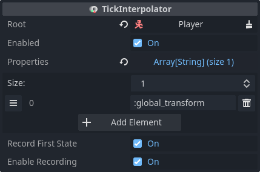

# Responsive player movement

To compensate for latency, *netfox* implements [Client-side prediction and
Server reconciliation]. This documentation also refers to it as rollback.

One use case is player movement - with CSP we don't need to wait for the
server's response before the player's avatar can be updated.

## Gathering input

For CSP, input is separated from player state. In practice, this means that
there's a separate node with its own script that manages input. The job of this
script is to manage properties related to input - for example, which direction
the player wants to move:

```gdscript
extends Node
class_name PlayerInput

var movement = Vector3.ZERO
```

These *input properties* must be updated based on player input. Hook into the
[network tick loop]'s *before_tick_loop* signal to update input properties:

```gdscript
func _ready():
  NetworkTime.before_tick_loop.connect(_gather)

func _gather():
  if not is_multiplayer_authority():
    return

  movement = Vector3(
    Input.get_axis("move_west", "move_east"),
    Input.get_action_strength("move_jump"),
    Input.get_axis("move_north", "move_south")
  )
```

It is important to only update input properties if we have authority over the
node. Otherwise we would try to change some other player's input with our own
actions.

### Using BaseNetInput

The same can be accomplished with [BaseNetInput], with slightly less code:

```gdscript
extends BaseNetInput
class_name PlayerInput

var movement: Vector3 = Vector3.ZERO

func _gather():
  movement = Vector3(
    Input.get_axis("move_west", "move_east"),
    Input.get_action_strength("move_jump"),
    Input.get_axis("move_north", "move_south")
  )
```

## Applying movement

The other part of the equation is *state*. Use the same approach as you would
with your character controller, with the game logic being implemented in
`_rollback_tick` instead of `_process` or `_physics_process`:

```gdscript
extends CharacterBody3D

@export var speed = 4.0
@export var input: PlayerInput

func _rollback_tick(delta, tick, is_fresh):
  velocity = input.movement.normalized() * speed
  velocity *= NetworkTime.physics_factor

  move_and_slide()
```

Note the usage of `physics_factor` - this is explained in [the caveats].

## Configuring rollback

Create a reusable player scene with the following layout:



The root is a *CharacterBody3D* with the player controller script attached.

The *Input* child manages player input and has the player input script
attached.

The [RollbackSynchronizer] node manages the rollback logic, making the player
motion responsive while also keeping it [server-authoritative].

Configure the *RollbackSynchronizer* with the following input- and state
properties:



## Ownership

Make sure that all of the player nodes are owned by the server. The exception
is the *Input* node, which must be owned by the player who the avatar belongs
to.

After setting ownerships, **make sure** to call `process_settings` on
*RollbackSynchronizer*. This call is necessary after every ownership change.
*RollbackSynchronizer* sorts properties based on ownership, but this sorting is
only done in `process_settings`.

For example:

```gdscript
@onready var rollback_synchronizer = $RollbackSynchronizer
var peer_id = 0

func _ready():
  # Wait a frame so peer_id is set
  await get_tree().process_frame

  # Set owner
  set_multiplayer_authority(1)
  input.set_multiplayer_authority(peer_id)
  rollback_synchronizer.process_settings()
```

Note that `peer_id` needs to be set from the outside during spawn.

## Smooth motion

Currently, state is only updated on network ticks. If the tickrate is less than
the FPS the game is running on, motion may get choppy.

Add a [TickInterpolator] node and configure it with the same *state properties*
as the *RollbackSynchronizer*:



This will ensure smooth motion, regardless of FPS and tickrate.

[Client-side prediction and Server reconciliation]: https://www.gabrielgambetta.com/client-side-prediction-server-reconciliation.html
[BaseNetInput]: ../../netfox.extras/guides/base-net-input.md
[network tick loop]: ../guides/network-time.md#network-tick-loop
[RollbackSynchronizer]: ../nodes/rollback-synchronizer.md
[server-authoritative]: ../concepts/authoritative-servers.md
[the caveats]: ./rollback-caveats.md#characterbody-velocity
[TickInterpolator]: ../nodes/tick-interpolator.md
