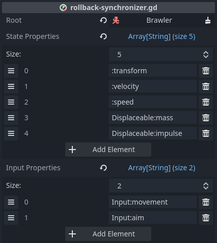

# RollbackSynchronizer

Manages state during the network rollback loop by hooking into
[NetworkRollback] events. Simulates nodes as required during rollback.

## Configuring state and input

To use *RollbackSynchronizer*, add it as a child to the target node, specify
the root node, and configure which properties to manage:



*Root* specifies the root node for resolving state and input properties. Best
practice dictates to add *RollbackSynchronizer* under its target, so *Root*
will most often be the *RollbackSynchronizer*'s parent node.

*State properties* are recorded for each tick and restored during rollback. For
state, the server is the ultimate authority.

*Input properties* are gathered for each player and sent to the server to use
for simulation.

See [Property paths] on how to specify properties.

> *Note* that it is not recommended to have both state and input properties on
> the same node. Since nodes with state belong to the server, and nodes with
> input belong to the player, it is difficult to separate ownership on the same
> node.

## Writing rollback-aware scripts

During setup, *RollbackSynchronizer* finds all the rollback-aware nodes under
the specified *root*. During rollback, it will call all the rollback-aware
nodes to simulate new state.

To learn about rollback-awareness, see [NetworkRollback].

In short, implement `_rollback_tick` in your scripts:

```gdscript
extends CharacterBody3D

@export var speed = 4.0
@export var input: PlayerInput

func _rollback_tick(delta, tick, is_fresh):
  velocity = input.movement.normalized() * speed
  velocity *= NetworkTime.physics_factor

  move_and_slide()
```

## Changing configuration

*RollbackSynchronizer* has to do some setup work whenever the state or the
input properties change.

By default, this work is done upon instantiation. If you need to change state
or input properties during runtime, make sure to call `process_settings()`,
otherwise *RollbackSynchronizer* won't apply the changes.

While changing configuration after instantiation is possible, it is not
recommended. You may get away with it if the configuration change happens in a
few ticks after instantiation. For longer periods, experiment at your own risk.

[NetworkRollback]: ../guides/network-rollback.md
[Property paths]: ../guides/property-paths.md
