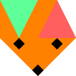
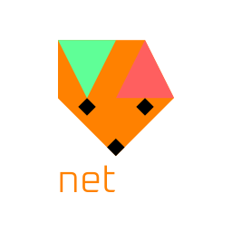
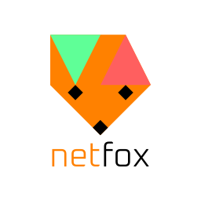
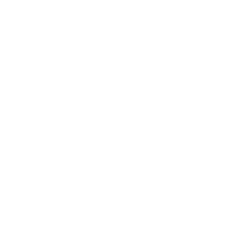

# Press kit

Attribution when using *netfox* is optional, but very much appreciated! We love
seeing games and projects built with netfox in the wild!

If you decide to give us a shout-out, here are some guidelines and assets to
represent netfox.

## When to use

**Feel free** to use *netfox* brand assets in your video games, videos, art,
images, and other mediums when the project relates to netfox.

For example:

* Adding a logo to your credits screen in your game using netfox
* Adding a banner to your video thumbnail discussing netfox
* Adding the banner to your article as illustration when discussing netfox

The list above is not exhaustive.

**Refrain** from using *netfox* brand assets in content involving hate speech,
politically charged content, or in unauthorized, commercially sold merch (
T-shirts, mugs, stationery, etc. ).

!!!tip
    When in doubt, reach out to us in the comments on the bottom of this page,
    start new [discussion], or ask over on our [Discord].

## Brand assets

The *netfox* brand assets use the [Oxanium] font family under the [SIL Open
Font License].

Each asset comes in multiple variants, so they can be used on light or dark
backgrounds, with or without colors.

### Icon

  

  [SVG](./assets/press-kit/netfox-icon.svg) | 
  [PNG](./assets/press-kit/netfox-icon.svg.preview.png) | 
  [PNG large](./assets/press-kit/netfox-icon.svg.large.png)

  

  [SVG](./assets/press-kit/netfox-icon-black.svg) | 
  [PNG](./assets/press-kit/netfox-icon-black.svg.preview.png) | 
  [PNG large](./assets/press-kit/netfox-icon-black.svg.large.png)

  

  [SVG](./assets/press-kit/netfox-icon-white.svg) | 
  [PNG](./assets/press-kit/netfox-icon-white.svg.preview.png) | 
  [PNG large](./assets/press-kit/netfox-icon-white.svg.large.png)

### Vertical banner

  

  [SVG](./assets/press-kit/netfox-banner-ver.svg) | 
  [PNG](./assets/press-kit/netfox-banner-ver.svg.preview.png) | 
  [PNG large](./assets/press-kit/netfox-banner-ver.svg.large.png)

  

  [SVG](./assets/press-kit/netfox-banner-ver-alt.svg) | 
  [PNG](./assets/press-kit/netfox-banner-ver-alt.svg.preview.png) | 
  [PNG large](./assets/press-kit/netfox-banner-ver-alt.svg.large.png)

  

  [SVG](./assets/press-kit/netfox-banner-ver-black.svg) | 
  [PNG](./assets/press-kit/netfox-banner-ver-black.svg.preview.png) | 
  [PNG large](./assets/press-kit/netfox-banner-ver-black.svg.large.png)

  

  [SVG](./assets/press-kit/netfox-banner-ver-white.svg) | 
  [PNG](./assets/press-kit/netfox-banner-ver-white.svg.preview.png) | 
  [PNG large](./assets/press-kit/netfox-banner-ver-white.svg.large.png)

### Horizontal banner

  

  [SVG](./assets/press-kit/netfox-banner-hor.svg) |
  [PNG](./assets/press-kit/netfox-banner-hor.svg.preview.png) |
  [PNG large](./assets/press-kit/netfox-banner-hor.svg.large.png)

  

  [SVG](./assets/press-kit/netfox-banner-hor-alt.svg) |
  [PNG](./assets/press-kit/netfox-banner-hor-alt.svg.preview.png) |
  [PNG large](./assets/press-kit/netfox-banner-hor-alt.svg.large.png)

  
  

  [SVG](./assets/press-kit/netfox-banner-hor-black.svg) |
  [PNG](./assets/press-kit/netfox-banner-hor-black.svg.preview.png) |
  [PNG large](./assets/press-kit/netfox-banner-hor-black.svg.large.png)

  
  

  [SVG](./assets/press-kit/netfox-banner-hor-white.svg) |
  [PNG](./assets/press-kit/netfox-banner-hor-white.svg.preview.png) |
  [PNG large](./assets/press-kit/netfox-banner-hor-white.svg.large.png)

[discussion]: https://github.com/foxssake/netfox/discussions
[Discord]: https://discord.gg/xWGh4GskG5
[Oxanium]: https://github.com/sevmeyer/oxanium
[SIL Open Font License]: https://openfontlicense.org/
