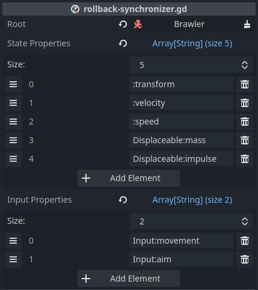
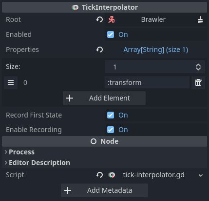
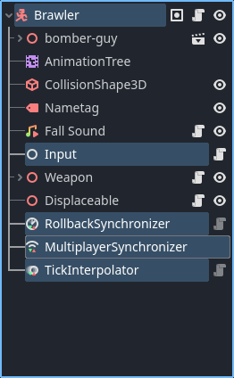

# Rollback

You may have noted earlier that documentation talks about *rollback*, *lag
compensation* and even *CSP* ( client-side prediction and server reconciliation
) multiple times, almost interchangeably.

The docs refer to CSP as rollback. They are a way to do lag compensation.

## The Challenge

You don't want your players to cheat. Nobody does. However, you publish your
game and give it to the player. The player's environment is entirely out of the
developer's control, players do whatever they want with it, which gives lots of
room to cheat.

For example, there were some applications that scanned a game's entire memory
and watched it for changes. When the player lost some health, the memory
address of the change was detected, and always set to its original value. This
way, whenever the player received damage in the game, this external application
would reset the player's health.

Since this was something people did in the early '00s, one could imagine that
cheating is still something very doable. All of this is to show that as game
developer, you do not want to trust the clients.

So what can you control? The server. This is how server-authoritative games
were born.

The idea is to simulate the whole game on the server and make it the source of
truth. Clients submit their inputs ( i.e. "I'm running north" ) on each tick,
the server updates the game state, and broadcasts the changes. All is swell.

Unless you consider latency. Let's say the latency is 50ms. Which means that
when the player presses a key to provide input, it will take 50ms for that
input to travel to the server, then some time passes as the server processes
all the inputs, then another 50ms for the new state to arrive.

Basically, it took slightly more than a tenth of a second before anything
happened on the player's screen after pressing a key. Aside from niche cases,
this is not very enjoyable. Not even mentioning that 50ms is a pretty decent
latency - in worse cases, it can be even 100-200ms, it can vary, it can jitter,
packets can be lost, all depending on network conditions.

This is where Client-Side Prediction and Server Reconciliation come in to save
the day. Instead of waiting for the server to return to us with a new game
state, we simulate *some* of the updates locally as well - for example, player
movement. We move the player along according to the input, then take a note of
the result. Once the server returns with the updated game state, clients can
adjust their local simulations accordingly. 

Most of the time, the clients' simulation will match that of the server, so
nothing happens. In case the client simulated something differently ( or was
cheating ), reconciliation kicks in and the difference will be corrected.

And thus, we can have our cake and eat it too - we consider the server as the
single source of truth, but also get responsive controls.

Further reading:

* [Client-Server Game Architecture](https://www.gabrielgambetta.com/client-server-game-architecture.html)
* [Client-Side Prediction and Server Reconciliation](https://www.gabrielgambetta.com/client-side-prediction-server-reconciliation.html)

## Setting up rollback

Similar to Godot's `MultiplayerSynchronizer`, netfox's node for rollback is
`RollbackSynchronizer`. And much in the same vein, you can configure it with
state and input properties:



To use it, simply add it to your scene. The best practice is to add it directly
under the object you want it to synchronize.

*Root* is the node you want to synchronize. Typically this is the
synchronizer's parent, as per best practice. Not setting this field will result
in error.

*State properties* describe the synchronized object's current state - whatever
properties are listed here will be synchronized over the network. The
screenshot provides a good example for movement - we want to synchronize the
player's transform and velocity, so we can replicate motion across
clients.

*Input properties* point to properties describing the player's inputs. Inputs
are also replicated across the network, but are used to update the simulation.
The server uses these inputs to update its local state and broadcast it, which
the clients will accept as truth.

## Gathering input

To gather the player's input, all you need to do is set the configured *input
properties* from your code - the rest will be handled by
`RollbackSynchronizer`.

The other important part is *when* to set these properties. On each frame,
netfox checks the time elapsed since the last network tick, and runs as many
ticks as necessary. So, it may happen that during a single `_process` run, no
network ticks are run, a single tick is run, or even multiple.

When running multiple ticks in a single `_process`, it makes no sense to poll
your input devices for each tick, as they most probably won't change. Instead,
you can set your properties at the start of the network tick loop:

```gdscript
class_name PlayerInput

var movement: Vector3 = Vector3.ZERO

func _ready():
  NetworkTime.before_tick_loop.connect(_gather)

func _gather():
  if not is_multiplayer_authority():
    return

  movement = Vector3(
    Input.get_axis("move_west", "move_east"),
    Input.get_action_strength("move_jump"),
    Input.get_axis("move_north", "move_south")
  )
```

Notice that we only set the movement variable if we have the authority over the
input node. This is important, otherwise everyone would be controlling
everyone's avatar.

While it is useful to know the details, *netfox.extras* provides a convenience
class called `BaseNetInput` that you can extend to do pretty much the same
thing, but slightly easier:

```gdscript
extends BaseNetInput
class_name PlayerInput

var movement: Vector3 = Vector3.ZERO

func _gather():
  movement = Vector3(
    Input.get_axis("move_west", "move_east"),
    0,
    Input.get_axis("move_north", "move_south")
  )
```

The two snippets above accomplish the same behaviour.

## Writing rollback-aware simulation

Writing your rollback-aware simulation is very similar to your regular
simulation - the most significant change is where you put your behaviour.

Instead of `_process` or `_physics_process`, you implement `_rollback_tick` to
simulate a network tick. This method is automatically discovered by the
`RollbackSynchronizer` and called as necessary. Before calling it, the
synchronizer will restore the state of the given tick, so your simulation code
doesn't need to bother with that either. You can think of it as travelling back
in time and re-running a frame.

Since inputs may arrive at different times for the same tick, we may need to
re-simulate the same tick multiple times as the game goes on. To make it easier
to discern which point of time is being simulated, the `_rollback_tick` method
receives multiple parameters:

```gdscript
func _rollback_tick(delta: float, tick: int, is_fresh: bool)
```

*delta* is the same as for `_process` or `_physics_process`, the amount of time
in seconds elapsed since the last tick.

*tick* is the current time of the simulation, in ticks. This can and will be
different from `NetworkTime.tick`.

*is_fresh* is a flag that indicates whether or not this is the first time we're
simulating this given tick. This is useful for triggering particle systems or
sound effects, since you don't want to spawn an explosion every time we
resimulate that same frame.

So to put it all together into a simple example:

```gdscript
extends CharacterBody3D

@export var speed = 4.0
@export var input: PlayerInput

func _rollback_tick(delta, tick, is_fresh):
  velocity = input.movement.normalized() * speed
  velocity *= NetworkTime.physics_factor

  move_and_slide()
```

Note that the velocity is pre-multiplied before executing the move, which
counteracts one of the caveats discussed below.

## Smoothing motion

Using the above as-is would lead to responsive gameplay with rollback, but
certainly wouldn't feel like it - motion would be choppy. This happens because
the player's position would only be updated during network ticks, which are set
to 30 ticks per second by default.

Instead of setting this to 60 or 120 and blasting through your bandwidth, you
can use the `TickInterpolator` node, which will smoothly interpolate *state
properties* between ticks.

To do so, simply add the node and configure it similarly to
`RollbackSynchronizer`:



*Root* is the starting point for interpolation, property paths will be
considered relative to this node.

*Properties* are the state properties to be interpolated between ticks. Note
that these are only used for visuals, so you'd rarely need to interpolate
velocity for example.

## Node setup

To tie all of the above together, you need your rollback-aware simulation on
your character, under which you add your input node and configure a
`RollbackSynchronizer` and a `TickInterpolator`. For any other properties that
don't need rollback-aware synchronization, you can use Godot's built-in
`MultiplayerSynchronizer`.

For reference, take a look at the following node setup from Forest Brawl:



## Caveats

### CharacterBodies and velocity

Calling `move_and_slide()` will move the object based on its `velocity`
property. However, this velocity, taken as m/s, will assume the current
`_process` or `_physics_process` delta, depending on whether we're in a physics
frame or a regular one.

This becomes an issue when it's called from a network tick or rollback tick, as
Godot's built-in methods are not aware that they're being called in netfox's
tick loop.

To work around this issue, you can use `NetworkTime.physics_factor` as a
multiplier on your velocities. This property will always yield a multiplier
that can be used to convert the velocity specified in the network tick's
context to the current frame context.

If you don't want to lose your original velocity ( e.g. because it accumulates
acceleration over time ), you can just divide by the same property after using
any built-in method. For example:

```gdscript
# Apply movement
velocity *= NetworkTime.physics_factor
move_and_slide()
velocity /= NetworkTime.physics_factor
```

### CharacterBodies and floors

CharacterBodies have multiple utilities to see if they're on the floor,
touching a wall, etc. However, these are only updated after a
`move_and_slide()` call.

This means that between two `move_and_slide`'s, rollback may kick in and place
the node in a completely different position, while the utilities would still
provide info based on the previous state.

You can do this by simply doing a zero-move before checking if the node is e.g.
on the floor:

```gdscript
extends CharacterBody3D

func _rollback_tick(delta, tick, is_fresh):
	# Add the gravity.
	_force_update_is_on_floor()
	if not is_on_floor():
		velocity.y -= gravity * delta

  # ...

func _force_update_is_on_floor():
	var old_velocity = velocity
	velocity = Vector3.ZERO
	move_and_slide()
	velocity = old_velocity
```

### Physics updates

Godot's physics system is updated only during `_physics_process`, while
rollback updates the game state multiple times during a single frame.

Unfortunately, Godot does not support manually updating or stepping the physics
system, at least at the time of writing. This means that:

* Rollback and physics-based games don't work at the moment
* Collision detection can work, but with workarounds

If there's a way to force an update for your given node type, it should work.
