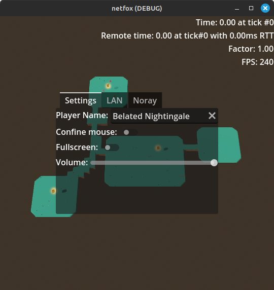
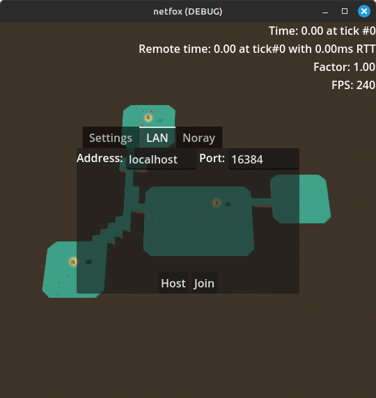
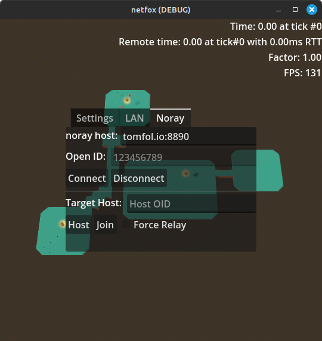
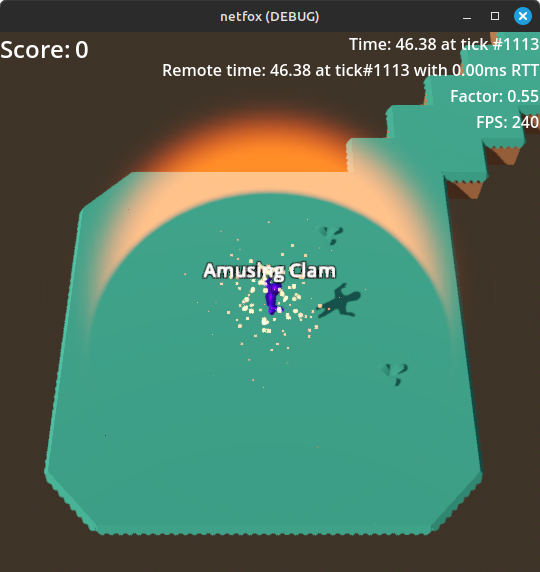

# Forest Brawl

An example game made with the [Godot Engine] to take [netfox] for a spin.

## Features

* 👥 Play with as many friends as you'd like ( and the network permits )
* 🌐 Play over LAN or over the internet, anywhere, courtesy of [noray]
* 👑 Knock your friends out and hold on to the crown as long as you can
* 🎁 Stay on top of the powerup meta

## Overview

Forest Brawl is a simple party game to play with as many friends as can fit on
the map! Each player can throw bombs, with the goal of knocking the others down
into the abyss. Players get a point for each knockout - the Mysterious Floating
Crown👑 follows the player with the top score, as an assertion of dominance.

Take note of your surroundings and timings, as powerups are scattered
throughout the map, each awarding you with a random effect. Stay on top of the
powerup respawns and dominate the competition!

## Install

### From source

Clone this repository and open the Godot project in the root. Running the
project will default to Forest Brawl.

### Release

TBA

## Play

### Setup

After launching the game, the following screen greets you:

Among others, you may specify your player name ( defaults to a random animal ).

Once done, move on to either the LAN or Noray tab, depending on whether you
want to play over LAN or over the internet.

### LAN

To host a game, specify the port for the server to listen on. The *Address*
field is ignored in this case. When done, press *Host*.

To join someone's game, specify their device's address and port where the
server is listening. When done, press *Join*.

### noray

Specify the noray host ( or leave as-is ), then hit *Connect*. Upon successful connection, the *Open ID* field will change value.

To host a game, copy the Open ID and press *Host*. Share the copied Open ID
with your friends and have fun!

To join a game, paste the received Open ID to the *Target Host* field and press
*Join*. If you find yourself often having trouble with connecting on the first
try, you may check *Force Relay* to skip the NAT punchthrough.

### Controls

| Input             | Function |
|-------------------|----------|
| WASD              | Movement |
| Mouse             | Aim      |
| Space             | Jump     |
| Left Mouse / Ctrl | Fire     |

> *Note:* Gamepad controls are supported, although it lacks aim assist.

## License

Forest Brawl is under the [MIT license](../../LICENSE).

Sound effects belong to various authors who made their work available through permissive licenses. See [Attribution](sounds/attribution.md).

The game uses [Kenney]'s [Platformer Kit]. See [license](models/kenney-platformer-kit/License.txt).

## Issues

In case of any issues, comments, or questions, please feel free to [open an issue]!

[Godot engine]: https://godotengine.org/
[netfox]: https://github.com/foxssake/netfox
[noray]: https://github.com/foxssake/noray

[Kenney]: https://www.kenney.nl/
[Platformer Kit]: https://www.kenney.nl/assets/platformer-kit

[open an issue]: https://github.com/foxssake/netfox/issues
