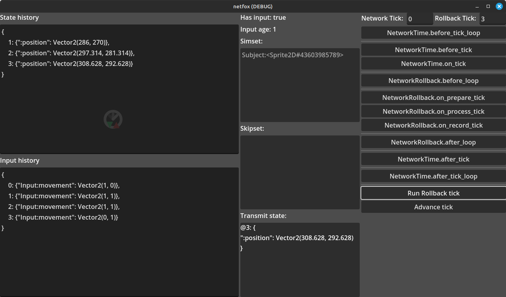

# Rollback Debugger

A small tool to help visualize and debug what happens during rollback, signal
by signal.

## Usage

Open `rollback-debugger.tscn`. 

Replace the *Subject* node with the rollback-enabled node you want to debug.

Optionally, edit `rollback-debugger.gd` and set the State and Input history
fields' values to the initial states after the first `_render_data()` call, to
avoid having to paste the same values on each run.

Editable fields are taken into consideration and applied before every signal.
